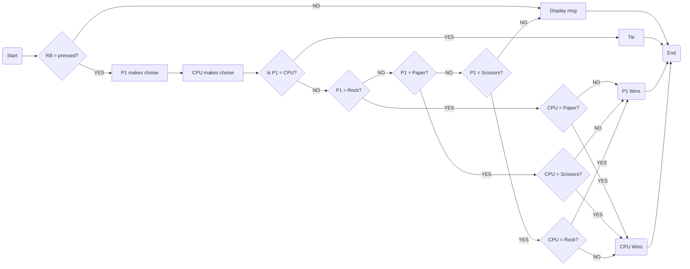

# Personal FHICT Repo

## Welcome

I'd like to welcome you to my personal FHICT repo. This repo is meant for sharing code I've created during my school career. Feel free to take a look, or try some scripts that I've created.

## FHICT

If you're wondering what FHICT actually stands for, let me explain. FH stands for "Fontys Hogescholen" and ICT stands for "Information & Communication Technology". Fontys is the place I'm currently studying at, which is located in Eindhoven, the Netherlands. ICT is the bachelor's degree in IT in my country.

## About Me

Nothing here yet...

## Flowchart Demo

This is a test!

## Sources
